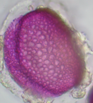

| Group          | Sub-group           | Features            | Image |
| --- | --- | --- | --- |
| Aceraceae                   | Maple, Sycamore              | 'Radioactive'. Round. Sometimes bark-like exine.  _cf. OSR, Rosaceae, Rubus_ |  |
| Apiaceae                    | Carrot/Hogweed               | Cylindrical, raised central pores. _cf. Fabaceae, Knapweed, Chestnut_ |  |
| Asteraceae                  | Daisy                        | Finer spikes/hairs/dots.     |      |
|                             | Dandelion                    | Spiky hexagon shells.       |  |
|                             | Thistle                      | Broad, triangular spikes.     |    |
| Crocus                      |                              | Massive thick-walled sphere. (100um) |    |
| Heathers                     | Erica                        | Tetrad - 4 grains: 3 plus 1 on top or underneath. |  |
|                             | Ling                         | Tetrad - 4 grains: 'clumped'. |  |
| Grains and Grasses          |                              | Round, single pore.         |      |
| Hazel                       |                              | Round with 'teat' pores (25um). _cf. Lime, Honeysuckle_ |  |
| Himalayan Balsam            |                              | Rectangle with slashed corners. 'Saltire'    |     |
| Honeysuckle                 |                              | Rounded triangle, spikes, corner pores. _cf. Hazel, Honeysuckle_ |  |
| Liliaceae                   | Alliums, Lilies              | Long 'folded' furrow. Like slashed bread |  |
| Malvaceae                   | Lime (Tilia)                 | 3 indented/cut-in pores. _cf. Hazel, Honeysuckle_    |      |
|                             | Mallow                       | Massive, spiky 'sea mines'. (100um). _cf. Hollyhock_ |      |
| 'Mediterranean' Herbs       | Thyme                        | Hexagons with 'spoked' furrows. _cf. Phacelia_     |  |
| OSR                         |                              | 'Radioactive' netted flattened sphere.  _cf. Aceraceae, Rosaceae, Rubus_ |  |       
| Phacelia                    |                              | Striped 'Beachball'. _cf. Thyme_        |   |
| Pinus                       | Pine                         | Air sacs. 'Teddy Bear head'. |   |
| Privet                      |                              | Netted, 3 pores: droplet-like, sometimes yellow. _cf. Ivy, Holly_ |  |
| Ribes (Currant/Gooseberry)  |                              | Round, 6+ round/bubble pores.   |      |
| Rosaceae                    |Rubus (Blackberry/Raspberry)  | 'Radioactive'. _cf. Acer, OSR, Rubus_  |      |
|                             |'Top Fruit' (Apple/Plum/Pear etc) | 'Radioactive'.  _cf. Acer, OSR, Rosaceae_  |      |
| Willowherb                  |                              | 'Bubbly' - Large, spherical with 3 swollen pores (75um).  _Example image shows yeast-damage_    |     |
| | | **https://mrichar1.github.io/pollen_id/** | |
